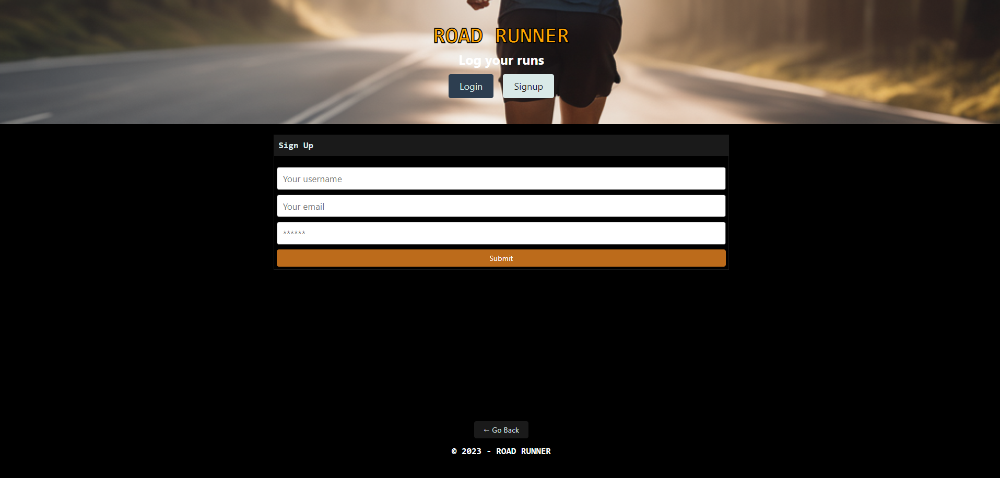
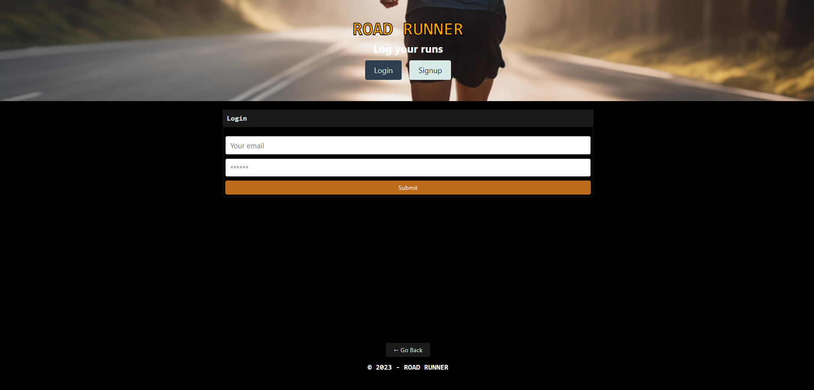

# RoadRunner
An online application to track your runs after your workout

## User Story

```md
AS A workout log specifically designed for runners
I WANT to log each run, using time and distance,
SO THAT I can access these logs to track progress
```

## Acceptance Criteria

```md
GIVEN a single-page application for workouts
WHEN I login 
THEN I am presented with the user's profile, displaying all of their previously logged runs
WHEN I add a run to my logs, inputing distance and time,
THEN the data is saved and a new card for this run is displayed below the form
WHEN I click on the delete button to the right of each run
THEN I am able to successfully delete runs from the user's logs
WHEN I logout
THEN I am taken back to the main login/signup page
```

## Mock Up

The following is a screenshot of the home page.


The following is a screeenshot of the signup page.



The following is a screenshot of the login page.



The following is a screenshot of a profile page including previously logged runs.


## Deployed Site

Click [here](https://road-runner-pro-0363fed701ee.herokuapp.com/) to go to the RoadRunner deployed site.